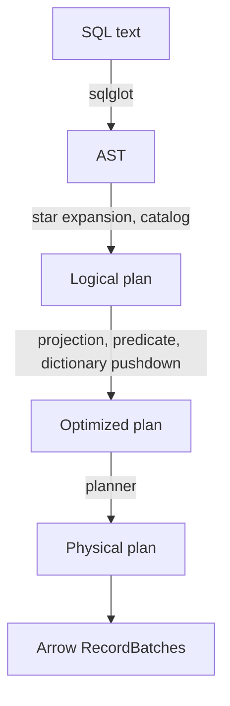

# mini-query-engine

A columnar query engine built from scratch in Python. SQL goes in, Arrow
batches come out.

Parquet scanning with statistics-based row group pruning, a rule-based
optimizer, vectorized operators, and a hash join that spills to disk when
the build side does not fit in memory.

Not a production engine. Built to understand what production engines do,
and to measure rather than assume.

## Results

5M users × 20M orders. Intel i5-13420H, 15.7 GB RAM, NVMe SSD, Windows 11,
Python 3.14.5, pyarrow 25.0.1. Warm-up discarded, median of repeated runs.

| Operation | Naive | Optimized | Speedup |
|---|---|---|---|
| Filter, 5M rows | 0.321 s | 0.049 s | 6.5x |
| Group by, 10 groups | 1.734 s | 0.277 s | 6.3x |
| Hash join, 5M × 20M | 229.2 s | 5.28 s | **43x** |

Against DuckDB on identical queries, both consuming the full result. Row
counts match DuckDB in every case.

| Query | mine | duckdb | ratio |
|---|---|---|---|
| Filter, sorted column | 0.041 s | 0.034 s | **1.2x** |
| `SELECT *`, filtered | 0.342 s | 0.222 s | 1.5x |
| Filter, random column | 0.402 s | 0.224 s | 1.8x |
| Hash join, 5M × 20M | 4.083 s | 1.792 s | 2.3x |
| Group by, 10 groups | 0.210 s | 0.023 s | 9.1x |

DuckDB is C++, multi-threaded and years of optimization deep. The point of
the comparison is not to win it but to see where the gap opens and explain
why. It is smallest on the statistics-pruned filter, where the optimization
removes work rather than speeding it up.

Row group pruning, same engine and file, two predicates:

| Query | Groups read | Rows scanned | Rows returned |
|---|---|---|---|
| `WHERE id > 4900000` | 1 of 10 | 500,000 | 100,000 |
| `WHERE age > 79` | 10 of 10 | 5,000,000 | 79,595 |

`id` is written sequentially, so each row group holds a disjoint range and
min/max statistics exclude nine of them. `age` is random, so every group
reports 18–80 and nothing can be excluded. The difference is physical
ordering of the data, not the engine.

Full numbers and method in [BENCHMARKS.md](BENCHMARKS.md).

## Architecture




Logical nodes describe what is wanted and carry no execution code, which is
what makes them safe to rewrite. Physical operators pull batches from their
child with `yield`, so memory stays flat regardless of file size — except in
blocking operators, where it cannot.

### Optimizer rules

**Projection pushdown.** Walks the plan collecting every column any operator
needs, then tells the scan to read only those. `SELECT name FROM users WHERE
age > 30` reads two columns instead of four. The user never specifies this;
it is inferred from the plan.

**Predicate pushdown.** Carries the filter condition down to the scan, which
compares it against each row group's min/max statistics and skips groups
that cannot contain a match. Statistics disprove with certainty and confirm
only with probability, so the filter still runs on whatever survives.

**Dictionary pushdown.** Reads string grouping keys as dictionary-encoded
columns rather than plain strings, turning a string hash into an integer
one. Unlike the other two, this rule needs the file's schema rather than
just the plan shape — the first point where the optimizer has to know
something about the data itself.

## Optimization notes

### Hash join: 229 s to 5.28 s

Four implementations, all returning the same 20,000,000 rows.

| Implementation | Time |
|---|---|
| `Table.join` per probe batch | 229.2 s |
| `pc.index_in` per probe batch | 206.1 s |
| Python dict, built once | 62.6 s |
| Direct-address numpy array | 5.28 s |

Two independent costs turned out to be in play.

The first is **how often the lookup structure gets built**. Both
`Table.join` and `pc.index_in` are self-contained calls — neither knows the
build side is being reused, so each rebuilds from 5M keys on every one of
the 200 probe batches. That accounts for the gap between 229 s and 62.6 s.

The second is **per-row Python work on the probe side**, which accounts for
the gap between 62.6 s and 5.28 s.

The final version exploits a property of the data rather than a better
algorithm: build keys are dense integers 1..5,000,000, so the lookup is an
array index rather than a hash. Building it is one numpy scatter; probing a
batch is one numpy gather. Cost is 38.1 MB, or `(max_key + 1) * 8` bytes.

This does not generalize. The memory cost scales with the key *range*, not
the key count — sparse integer keys or string keys need a real hash table.
A rough test: `max_key / n_keys` above roughly 10 and the array is the wrong
choice.

### A vectorization that made things slower

`pc.index_in` was written to remove the Python loop from the probe side. It
did remove it, and came out 3x slower than the loop it replaced.

The loop was never the dominant cost. `pc.index_in` builds a lookup structure
from `value_set` on every call, which reintroduced the per-batch rebuild that
the dict version had already eliminated. A smaller problem got solved by
undoing the fix for a larger one.

Kept in the repository as `HashJoinVectorized`. Vectorization helps when it
removes repeated work; it hurts when it adds some.

### Spilling is a trade, not an optimization

The in-memory join holds the entire build side resident. At 5M rows that is
fine; at 200M it is not.

`GraceHashJoin` partitions both sides by `hash(key) % 16` into temporary
Parquet files and joins one partition at a time. Correctness rests on a
single property: equal keys hash to equal partitions, so a match can never
span two of them.

| | Time | Peak build rows resident |
|---|---|---|
| In-memory | 5.28 s | 5,000,000 |
| Grace hash join, 16 partitions | 27.85 s | 312,500 |

5.3x slower by design, with 312.8 MB written to and read back from disk.
Every other change in this project made the same work faster. This one makes
work possible that otherwise would not run at all — the alternative is not
"slower", it is out of memory.

### Partition skew

Two probe datasets, same join, same 16 partitions.

| Probe data | Largest partition | Share | max/min |
|---|---|---|---|
| 4.4M distinct users, top 5% hold 46% of orders | 1,252,111 | 6.26% | 1.00x |
| one user id holding 40% of orders | 8,749,871 | 43.75% | 11.69x |

The first dataset is genuinely skewed by distribution, and partitioning
absorbs it entirely: those 221,036 heavy keys spread evenly across 16
buckets.

The second is skewed on a single key. `7 % 16 = 7`, so all 8M of its rows
must land in partition 7. No hash function avoids this — a single key has
exactly one destination, and sending its rows anywhere else would break the
equal-keys-same-partition property the algorithm depends on.

Build side stays at 1.00x in both cases, because user 7 appears there exactly
once. Skew is a property of key repetition within a side, not of table size.

On one machine this shows up as elapsed time. On a 16-node cluster it means
15 nodes idle while one does 44% of the work. The usual real-world cause is a
`NULL` or sentinel value repeated across millions of rows.

### What component benchmarks could not catch

The first run of the DuckDB comparison put group by at 126x — an outlier
against ratios of 1.2x to 2.3x everywhere else.

Two things were wrong, and neither was visible from the component benchmarks.

The planner was building `GroupBy`, the row-at-a-time baseline, rather than
`GroupByVectorized`. The vectorized version had existed and been measured
since day 4 but was never wired into the planner, so every end-to-end query
had silently run the slow path for two weeks.

The second was the missing dictionary pushdown rule: a 3.3x gain that had
also been measured on day 4 and left sitting unused.

Together these took group by from 2.072 s to 0.210 s, closing the ratio from
126x to 9.1x.

Per-operator benchmarks measure operators in isolation. They cannot reveal
that the faster operator is never reached. Only an end-to-end comparison
against an external reference exposed it — which is a reason to run one even
when losing the comparison is a foregone conclusion.

### Measurement over intuition

Six predictions were made while optimizing. Five were wrong.

| Prediction | Measured |
|---|---|
| The scan dominates group-by time | 17% of it |
| Batch size is the bottleneck | 11% |
| Dictionary encoding gains 10–20% | 230% |
| `pc.index_in` beats the Python loop | 3x slower |
| Fixing group by would reach ~0.7 s | 0.210 s |
| `Table.join` rebuilds per batch | correct |

Each was settled by a diagnostic script that timed the parts separately —
`diag_groupby.py` and `diag_join.py` in this repository. Acting on the first
two would have meant optimizing components worth 17% and 11% of runtime;
acting on the fourth would have meant shipping a version 3x slower than the
one it replaced.

## Known limitations

- **`WHERE` supports one comparison, `>` only.** `FilterNode` has no operator
  field. Other operators are rejected explicitly rather than silently
  producing wrong results. No `AND`/`OR`.
- **`GROUP BY` always computes count, sum and avg.** The node takes a single
  aggregate column and no function list, so `count(*)` has to point at some
  numeric column and the extra aggregates are meaningless. Single grouping
  column only.
- **Join is not exposed through SQL.** It works through the Python API; the
  parser does not build join plans.
- **Build keys must be unique.** Duplicate keys overwrite each other in the
  index and rows are lost. Not detected.
- **`GraceHashJoin` always spills**, even when the build side would fit. A
  hybrid hash join would stay resident up to a memory budget and spill only
  past it.
- **Group by does not spill.** Its hash table is bounded by the number of
  distinct groups, which is small here but need not be.
- **Each row group carries its own dictionary.** Partial aggregates are
  decoded to strings before the second stage rather than unified.
- **No `ORDER BY`, `LIMIT`, subqueries, or window functions.**
- **Single-threaded.** Row groups are decoded in parallel by pyarrow, but
  operators are not.

## Running it

```bash
python -m venv .venv
source .venv/bin/activate        # Windows: .venv\Scripts\activate
pip install pyarrow sqlglot numpy duckdb

python gen_data.py               # 5M users   → data/users.parquet
python gen_orders.py             # 20M orders → data/orders.parquet
python gen_skewed.py             # 20M orders, one hot key
```

```python
from engine.engine import sql
from engine.sql import Catalog

catalog = Catalog({
    "users": "data/users.parquet",
    "orders": "data/orders.parquet",
})

for batch in sql("SELECT name FROM users WHERE age > 70", catalog):
    print(batch.num_rows)
```

Benchmarks and diagnostics:

```bash
python bench_filter.py           # vectorized vs row-at-a-time
python bench_groupby.py          # batch size and dictionary sweeps
python bench_vs_duckdb.py        # end-to-end comparison
python test_join.py              # join implementations
python test_spill_join.py        # grace hash join
python diag_skew.py              # partition distribution, both datasets
python inspect_parquet.py        # Parquet layout and per-row-group stats
```

Generated Parquet files are gitignored; the generators are seeded, so
re-running them reproduces the exact files the numbers were measured on.

## References

- Andy Pavlo, CMU 15-445 and 15-721 — database internals lectures
- Boncz, Zukowski, Nes — *MonetDB/X100: Hyper-Pipelining Query Execution*
- Apache DataFusion and DuckDB source, consulted for operator design